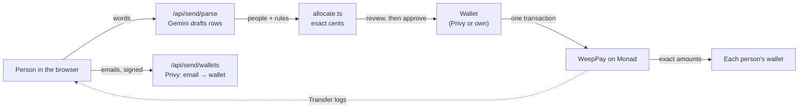

<div align="center">
  
  <h1>Weep</h1>
  <p><b>Pay a whole group at once, to the exact cent.</b></p>
  <p>Say who gets what in plain words. Check every amount. Everyone is paid in one Monad transaction, even people who only have an email.</p>
  <p>
    <a href="https://weep-protocol.vercel.app">Try it live</a> ·
    <a href="#verify-it-in-two-minutes">Verify it in two minutes</a> ·
    <a href="https://weep-protocol.vercel.app/how-money-moves">How money moves</a>
  </p>
  <p><sub>Testnet preview · Monad testnet (chain ID 10143) · Test dollars with no real-world value · Contracts not audited</sub></p>
</div>

---

## The problem

When one payment has to be shared among several people (a tip for the staff, prize money, a split bill), someone ends up doing the maths, moving the money person by person, and asking to be trusted.

- Tipping is now expected in more places, but the rules feel unclear. 72% of U.S. adults say tipping is expected in more places than five years ago, and only about a third find it easy to know whether (34%) or how much (33%) to tip. ([Pew Research Center](https://www.pewresearch.org/2023/11/09/tipping-culture-in-america-public-sees-a-changed-landscape/), 11,945 U.S. adults, August 2023)
- People doubt tips reach staff. 54% of consumers don't trust restaurants to pass tips on. ([URocked research via Restaurant Online](https://www.restaurantonline.co.uk/Article/2025/10/01/half-of-consumers-still-dont-trust-restaurants-to-pass-on-tips-according-to-new-research/), 1,000 UK consumers, October 2025)

Bank transfers and payment apps pay one person at a time. Group features usually collect money rather than split it, and the shares still have to be worked out by hand.

## What Weep does

Weep has two sides that share the same three slots, and people choose where to go.

| | Individual | Business |
|---|---|---|
| **Pay** | **Send**: describe a payment in words ("$60 to Sam, Ama and Kai, Sam gets half"), check the exact amounts, pay everyone in one transaction. | **Merchant Portal**: describe the team once; Weep saves the team and the tip split on Monad, then pays team tips out by that split. |
| **Receive** | **My money**: your balance, every payment in (how much, from whom, when) and your own pay-me link and QR code. | **Employee Dashboard**: every tip as it lands, including tips from individuals, plus a personal tip link. |
| **Tip** | **Tip**: scan or paste a code or link and land exactly where it points. | **Customer**: tip one person by name (100% to them) or the whole team. |

What sets it apart:

- **Exact.** Weep's own code, not the AI, works out every share to the cent, and the shares always add up to the total. The contract refuses any payment whose parts don't match the total you reviewed.
- **All at once, or not at all.** One WeepPay transaction pays up to 100 people. If one transfer fails, nobody is paid.
- **Anyone can be paid.** An email is enough. The money lands in a non-custodial wallet tied to that email, with nothing to claim.
- **Nothing to take on trust.** Receipts are read back from Monad, and every amount links to its transaction.

## Verify it in two minutes

1. **Open the live app.** Go to [weep-protocol.vercel.app](https://weep-protocol.vercel.app), choose **Get started**, keep **Individual**, and open **Send**.
2. **Describe a payment.** Paste `$100 split equally between ama@example.com, kai@example.com and sam@example.com` and press the arrow button. Weep shows $33.34, $33.33 and $33.33, and notes that one person gets 1¢ more so it's exact.
3. **Send it.** Sign in with any email. You need a little test MON for the fee, free from the [Monad faucet](https://faucet.monad.xyz). Weep adds test dollars if you're short, then pays all three in one transaction and shows the receipt.
4. **Check the chain.** Open the receipt link. You can also inspect a payment we made on 8 Oct 2026: [one transaction paying $100.00 as $33.34 / $33.33 / $33.33](https://testnet.monadexplorer.com/tx/0x8be685ec1e20eee98010745c8bbcaf0fa10d1e08967bd1f811f1c9e5594e44e9), two people by email and one by wallet. The sender was charged exactly $100.00 and the contract kept $0.
5. **Run the tests.** `cd contracts && npm install && npx hardhat test` gives 14 passing tests covering exact payouts, all-or-nothing, totals that don't match, allowances, team payouts and gas at 100 recipients.

## How it works



- The **AI reads and never decides.** Gemini turns words into rows: who, how to reach them, and whether their share is fixed, a percentage or equal. It does no maths and sends nothing.
- **Amounts are deterministic.** Fixed amounts come first, then percentages rounded down to the cent, then equal shares of the rest. Leftover cents go one each to the first people. ([allocate.ts](frontend/src/app/allocate.ts))
- **Emails become wallets on request.** The sender signs one fresh message naming the emails, and the server asks Privy for each person's wallet, creating it if needed. ([route](frontend/src/app/api/send/wallets/route.ts))
- **One transaction pays everyone.** Your wallet allows exactly the reviewed total, then `WeepPay.pay` moves each amount straight from you to each person. ([WeepPay.sol](contracts/contracts/WeepPay.sol))
- **Receipts come from the chain.** The receipt is built from the transaction's own `Transfer` logs, not from what the app intended.

The full design, every flow, the trust boundaries and failure handling are in [docs/architecture.md](docs/architecture.md).

## Why Monad

- **Paying many people in one transaction is practical.** In our tests, paying 100 new recipients used 2,948,328 gas, about 2% of Monad's 150,000,000 block gas limit, so a large group payout fits in a single all-or-nothing transaction. 20 recipients used 619,724 gas.
- **Fast confirmation suits paying in person.** A tip at the table or a payout at the end of a shift needs to finish while people are still there.
- **It's the standard EVM.** Standard ERC-20 approvals, Solidity, viem and existing wallets work unchanged, so anyone can verify Weep with familiar tools.

## Contracts

| Contract | Purpose | Network | Address | Source |
|---|---|---|---|---|
| WeepPay | One payment to up to 100 people, exact and all-or-nothing. No owner. | Monad testnet (10143) | [`0xa0209c2245FdD5928a7a602a2d4c7d4239CF5A26`](https://testnet.monadexplorer.com/address/0xa0209c2245FdD5928a7a602a2d4c7d4239CF5A26) | [WeepPay.sol](contracts/contracts/WeepPay.sol) |
| TipSplitter | A business's team, its tip split, tips by name and team payouts. Owner/agent controlled. | Monad testnet (10143) | [`0x06db4c849EF42653982694Ae924dC99DBB80EA35`](https://testnet.monadexplorer.com/address/0x06db4c849EF42653982694Ae924dC99DBB80EA35) | [TipSplitter.sol](contracts/contracts/TipSplitter.sol) |
| AUSD (test) | The 18-decimal test dollar Weep pays in. Anyone can mint. | Monad testnet (10143) | [`0xcEF38D455529Dbc2e37654452C288C25e18ADea4`](https://testnet.monadexplorer.com/address/0xcEF38D455529Dbc2e37654452C288C25e18ADea4) | [MockAUSD.sol](contracts/contracts/MockAUSD.sol) |

## Run it locally

**You need** Node.js 20 or later, a [Privy](https://dashboard.privy.io) app, and a [Gemini API key](https://aistudio.google.com/apikey).

```bash
git clone https://github.com/Joseph-hackathon/Weep-Protocol.git
cd Weep-Protocol/frontend
cp .env.example .env.local   # then fill in the values below
npm install
npm run dev                  # http://localhost:3000
```

| Variable | Needed for | Where it's used |
|---|---|---|
| `NEXT_PUBLIC_PRIVY_APP_ID` | Sign-in and wallets | Browser and server |
| `PRIVY_APP_SECRET` | Paying by email; creating a team's wallets | Server only |
| `GEMINI_API_KEY` | Reading descriptions in Send and the Merchant Portal | Server only |
| `NEXT_PUBLIC_TIP_SPLITTER` | The business pool. Use `0x06db4c849EF42653982694Ae924dC99DBB80EA35` to match the live site | Browser and server |
| `GEMINI_MODEL` | Optional: pin one Gemini model | Server only |
| `NEXT_PUBLIC_WEEP_PAY`, `NEXT_PUBLIC_AUSD`, `NEXT_PUBLIC_MONAD_RPC` | Optional: other contracts or RPC | Browser and server |

Without the server keys the app still runs. Send asks you to add people yourself, and email payments say they're not switched on.

**Contracts:**

```bash
cd contracts
npm install
npx hardhat test                                                  # 14 tests, local chain
npx hardhat run scripts/deploy-pay.js --network monadTestnet      # needs PRIVATE_KEY in contracts/.env
```

`contracts/.env` is git-ignored. Never commit a key.

The routes the app calls, with tested examples, are in [docs/api.md](docs/api.md).

## Security and trust

- **Weep never holds funds or keys.** WeepPay has no owner and never keeps a balance. Your wallet allows it to spend exactly the total you reviewed.
- **Business pools are owner-controlled.** The pool's owner or agent sets the team and split and starts payouts. Team tips wait in the pool until then, and tips by name skip the pool entirely.
- **Server routes need signatures.** An email lookup needs a fresh signature (under 10 minutes old) from the sender, naming the exact emails. Creating a team's wallets also needs the pool owner's signature.
- **Not audited.** The contracts are tested but haven't been independently audited, and this is a testnet preview.

Report vulnerabilities privately as described in [SECURITY.md](SECURITY.md).

## Limits

- Runs on testnet only. Test dollars have no value, and a payment can't be reversed once confirmed.
- The AI can misread. Every amount is shown for review, and nothing is sent without your approval. On 8 Oct 2026, 14 varied descriptions were all read correctly one at a time, but 3 returned a "try again" error when all 14 were sent at once.
- Weep doesn't notify people paid by email. They see the payment by signing in with that email.
- My money and the Employee Dashboard show payments that arrive while they're open, plus what's remembered on the device. Full history is on the [Monad testnet explorer](https://testnet.monadexplorer.com).
- Early experiments in this repository are not used by the live app: `chainlink-cre/`, `cre-workflow/`, the `api/policy`, `api/logs`, `api/merchant/setup` and `api/nansen` routes, `canton.html` and `daml-install.ps1`.

## Documentation

| Document | For |
|---|---|
| [How money moves](https://weep-protocol.vercel.app/how-money-moves) | Anyone: where money goes, what the code guarantees, what the AI does |
| [Terms of use](https://weep-protocol.vercel.app/terms) · [Privacy notice](https://weep-protocol.vercel.app/privacy) | Anyone using the service |
| [docs/architecture.md](docs/architecture.md) | Builders and reviewers: system, flows, trust boundaries, decisions |
| [docs/api.md](docs/api.md) | Developers: the server routes, with examples |
| [CHANGELOG.md](CHANGELOG.md) | What was built during the hackathon, by date |
| [SECURITY.md](SECURITY.md) | Reporting a vulnerability |

## Built with

[Monad](https://monad.xyz) for settlement · [Privy](https://privy.io) for email sign-in, embedded wallets and email-to-wallet lookups ([providers.tsx](frontend/src/app/providers.tsx), [send/wallets](frontend/src/app/api/send/wallets/route.ts)) · [Gemini](https://ai.google.dev) for reading descriptions ([send/parse](frontend/src/app/api/send/parse/route.ts)) · AUSD (test), a stand-in for Agora's AUSD dollar · Next.js, viem, Hardhat and OpenZeppelin.

## Team

Built for [Monad Metropolis](https://monad.xyz/metropolis), Consumer Products & Payments track, by [Joseph-hackathon](https://github.com/Joseph-hackathon) and [mauyaa](https://github.com/mauyaa).

## License

[MIT](LICENSE). The license covers the code. Using the hosted service is covered by the [Terms of use](https://weep-protocol.vercel.app/terms).
