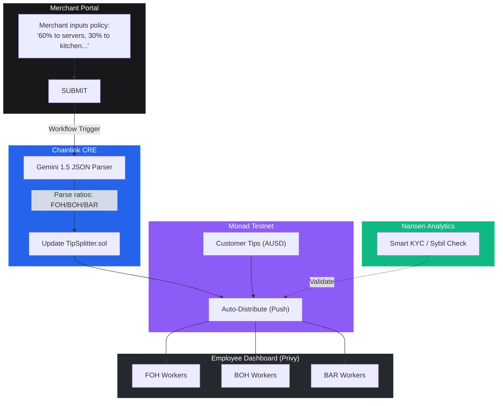

<div align="center">
  
  <h1>Weep Protocol</h1>
  <h3>Restore trust. Automate fairness.</h3>
  <p><b>Web3 Tip Payroll & Autonomous Policy Distribution on Monad.</b></p>
</div>

---

Weep transforms opaque, manual tip pooling into a transparent, frictionless on-chain engine powered by AI, Chainlink CRE, and Monad.

## The Problem: The $40B Tipping Crisis

The US restaurant and hospitality industry processes over **$40 Billion in tips annually**, yet the infrastructure for distributing this money is fundamentally broken:

1. **Administrative Nightmare:** Restaurant managers spend countless hours every week manually calculating tip pools across different roles (Front of House, Back of House, Bar). It requires messy spreadsheets and is highly prone to human error.
2. **Lack of Trust & Transparency:** Employees are entirely in the dark. They have to blindly trust that management calculated their tip share correctly, leading to high turnover and wage theft accusations.
3. **Legal & Compliance Liabilities:** Strict Department of Labor (DOL) regulations dictate exactly who can share in a tip pool. Manual errors frequently result in costly class-action lawsuits for merchants.
4. **Slow Payouts:** Workers often have to wait until their bi-weekly paycheck to receive the cash they earned on a busy Friday night.

## The Solution: Programmable Fairness

Weep Protocol replaces trust with mathematics and automation. We turn tipping into a seamless Web3 infrastructure layer:

- **Natural Language Policies:** Merchants don't need to write code. They simply type their tipping policy in plain English (e.g., *"60% to servers, 30% to kitchen, 10% to the bar"*).
- **Decentralized AI Oracles:** **Chainlink CRE** securely parses the merchant's natural language using Gemini 1.5 and translates it into an executable JSON payload.
- **Instant Settlement:** The parsed policy is executed on **Monad Testnet**. Customer tips (AUSD) flow directly into a Smart Contract and are instantly distributed to employee wallets via a zero-gas "Push" model.
- **Frictionless Onboarding:** Employees don't need to know anything about crypto. They log in via **Privy** to view their dashboard, automatically generating a non-custodial wallet in the background. **Nansen Smart KYC** ensures only verified employee wallets are added to the pool, preventing Sybil attacks.

## How it works



## Live Services & Integrations

| Component | Description |
|---|---|
| Frontend | Next.js App Router (Hosted on Vercel) |
| Smart Contract | `WeepVenues.sol` on Monad Testnet |
| Auth & Wallets | Privy (Seamless onboarding & Embedded Wallets) |
| Workflow & Oracle | Chainlink CRE (Decentralized Workflow Automation) |
| Analytics & Sybil | Nansen Smart KYC API |
| AI Parsing | Gemini 1.5 Pro |

## Quick Start

### 1. Run the local development server

```bash
cd frontend
npm install
npm run dev
```

Visit `http://localhost:3000` to view the landing page.
- `/merchant`: Access the Merchant Portal to input AI tip policies.
- `/employee`: Access the Employee Dashboard to view distributed AUSD tips via Privy.
- `/customer`: Access the Customer payment demo.

### 2. Contract Details
- **Network:** Monad Testnet
- **WeepVenues:** `0x4026433687A8324198Ef3FC56d09FccC6e672178`: any business opens its own venue (name, team, split rule); tips go straight into the team's wallets in the same transaction.
- **AUSD (test):** `0xcEF38D455529Dbc2e37654452C288C25e18ADea4`
- **TipSplitter (first version):** `0x1A245Dc83F286CA5A6833626E813776623f9F336`

### 3. Deploying Chainlink CRE Workflow
Navigate to the `chainlink-cre` directory to compile and upload the WASM workflow definition.

```bash
cd chainlink-cre
npm run compile
```

## Resources & Market Research
- [Pew Research Center: The State of Tipping in the U.S.](https://www.pewresearch.org/2023/11/09/services-and-industries-where-people-tip/) - Background on the scale and complexity of the US tipping culture.
- [U.S. Department of Labor: Tip Regulations (FLSA)](https://www.dol.gov/agencies/whd/flsa/tips) - Context on the strict legal compliance required for manual tip pooling.
- [SundayApp: Tipping Trends for Restaurants in 2025](https://sundayapp.com/en-gb/tipping-trends-for-restaurants-in-2025/) - Research on modern tipping behaviors and the shift towards digital gratuity.
- [RestaurantOnline: Half of consumers still don’t trust restaurants to pass on tips](https://www.restaurantonline.co.uk/Article/2025/10/01/half-of-consumers-still-dont-trust-restaurants-to-pass-on-tips-according-to-new-research/) - Validates Weep's core thesis that the industry suffers from a fundamental lack of trust and transparency.
- [HospitalityNet: Smooth operations: why the next wave of hotel tech is invisible](https://www.hospitalitynet.org/opinion/4129380.html) - Highlights the urgent need for backend automation (like Weep's Smart Contracts) to reduce administrative overhead in hospitality.

## Hackathon Bounty Implementations
Direct links to the specific code where we implemented the hackathon sponsor tracks:

- **Chainlink CRE:** 
  [View Implementation](https://github.com/Joseph-hackathon/Weep-Protocol/tree/main/chainlink-cre) 
  *(WASM workflow definition that parses natural language via Gemini 1.5 and executes on Monad)*
- **Monad (Smart Contracts):** 
  [View Implementation](https://github.com/Joseph-hackathon/Weep-Protocol/blob/main/contracts/contracts/WeepVenues.sol) 
  *(The `WeepVenues.sol` contract: a venue per business, instant push payouts to every team wallet, tips by name)*
- **Privy (Auth & Embedded Wallets):** 
  [View Implementation](https://github.com/Joseph-hackathon/Weep-Protocol/blob/main/frontend/src/app/providers.tsx) 
  *(Frictionless onboarding flow and wallet configuration for employees and merchants)*
- **Nansen (Smart KYC & Analytics):** 
  [View Implementation](https://github.com/Joseph-hackathon/Weep-Protocol/blob/main/frontend/src/app/api/nansen/route.ts) 
  *(Backend API intercepting wallet additions to run Sybil-checks and risk labeling via Nansen)*

*Built for the Monad Hackathon*
