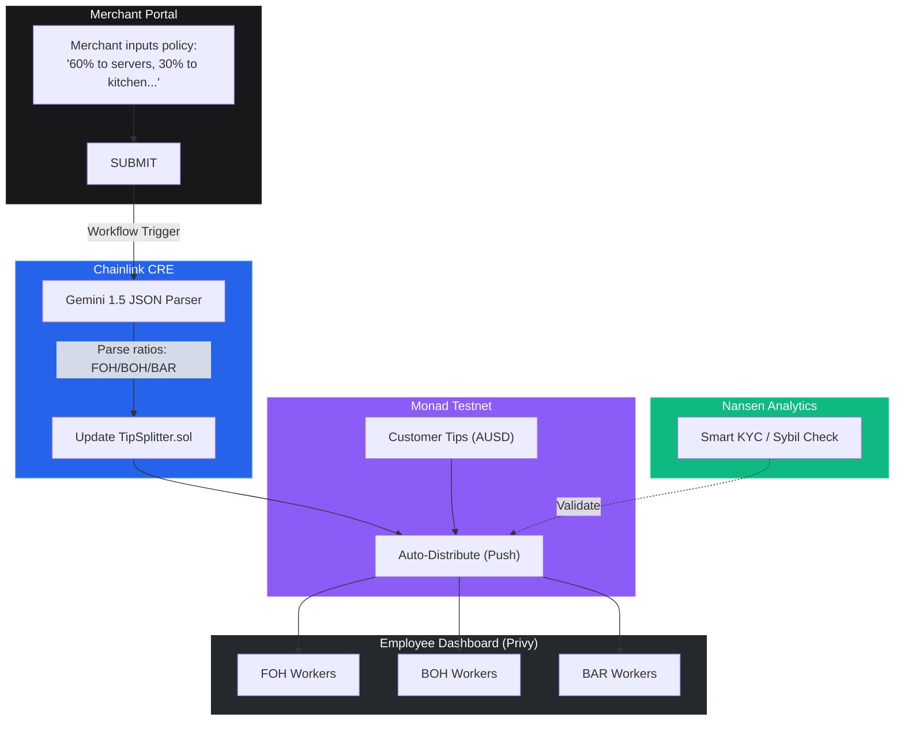

# Weep Protocol

Web3 Tip Payroll & Autonomous Policy Distribution on Monad. Weep transforms opaque, manual tip pooling into a transparent, frictionless on-chain engine powered by AI, Chainlink CRE, and Monad.

Legacy tip management processes are slow, admin-heavy, and lack transparency for workers. Weep solves this by bringing accountability, natural language AI parsing, and instant Web3 payouts directly to the point-of-sale.

## How it works



## Live Services & Integrations

| Component | Description |
|---|---|
| Frontend | Next.js App Router (Hosted on Vercel) |
| Smart Contract | `TipSplitter.sol` on Monad Testnet |
| Auth & Wallets | Privy (Seamless onboarding & Embedded Wallets) |
| Workflow & Oracle | Chainlink CRE (Decentralized Workflow Automation) |
| Analytics & Sybil | Nansen Smart KYC API |
| AI Parsing | Gemini 1.5 Pro |

## Quick Start

### 1. Run the local development server

```bash
cd frontend
npm install
npm run dev
```

Visit `http://localhost:3000` to view the landing page.
- `/merchant`: Access the Merchant Portal to input AI tip policies.
- `/employee`: Access the Employee Dashboard to view distributed AUSD tips via Privy.

### 2. Contract Details
- **Network:** Monad Testnet
- **Address:** `0x1A245Dc83F286CA5A6833626E813776623f9F336`

### 3. Deploying Chainlink CRE Workflow
Navigate to the `chainlink-cre` directory to compile and upload the WASM workflow definition.

```bash
cd chainlink-cre
npm run compile
```

*Built for the Monad Hackathon*
