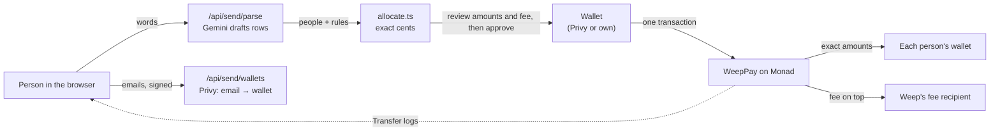

<div align="center">
  
  <h1>Weep</h1>
  <p><b>Pay a whole group at once, to the exact cent.</b></p>
  <p>Say who gets what in plain words. Check every amount. Everyone is paid in one Monad transaction, even people who only have an email.</p>
  <p>
    <a href="https://weep-protocol.vercel.app">Try it live</a> ·
    <a href="#verify-it-in-two-minutes">Verify it in two minutes</a> ·
    <a href="https://weep-protocol.vercel.app/how-money-moves">How money moves</a> ·
    <a href="https://x.com/WeepProtocol">@WeepProtocol on X</a>
  </p>
  <p><sub>Testnet preview · Monad testnet (chain ID 10143) · Test dollars with no real-world value · Contracts not audited</sub></p>
</div>

---

## The problem

When one payment has to be shared among several people (a tip for the staff, prize money, a split bill), someone ends up doing the maths, moving the money person by person, and asking to be trusted.

- Tipping is now expected in more places, but the rules feel unclear. 72% of U.S. adults say tipping is expected in more places than five years ago, and only about a third find it easy to know whether (34%) or how much (33%) to tip. ([Pew Research Center](https://www.pewresearch.org/2023/11/09/tipping-culture-in-america-public-sees-a-changed-landscape/), 11,945 U.S. adults, August 2023)
- People doubt tips reach staff. 54% of consumers don't trust restaurants to pass tips on. ([URocked research via Restaurant Online](https://www.restaurantonline.co.uk/Article/2025/10/01/half-of-consumers-still-dont-trust-restaurants-to-pass-on-tips-according-to-new-research/), 1,000 UK consumers, October 2025)

**One scenario.** After a gig, the crowd tips $340. The band agrees the drummer gets $100 and the other two split the rest. Today someone works out $120 each, sends three separate transfers, and the others take it on trust. With Weep, they type exactly that sentence, see $100 / $120 / $120, and one transaction pays all three. Each of them can open the same public receipt.

| | Today | With Weep |
|---|---|---|
| Working out the shares | By hand or in a spreadsheet | Code works out every cent; you check it |
| Paying | One transfer per person | One transaction for up to 100 people |
| Paying someone new | Ask for their bank or wallet details | Their email is enough |
| If something fails halfway | Some people are paid, some aren't | Everyone is paid, or no one is |
| Proof | Take the organiser's word | A public receipt anyone can open |

**Alternatives, honestly.**
- **Payment apps** (Venmo, Cash App) pay one person per payment and work out nothing.
- **Expense splitters** (Splitwise) work out who owes what, but the money still moves separately.
- **Tip-pool spreadsheets** leave staff unable to check their share.

Weep does the maths, the payment and the proof in one step.

## What Weep does

Weep has two sides that share the same three slots, and people choose where to go.

| | Individual | Business |
|---|---|---|
| **Pay** | **Send**: describe a payment in words ("$60 to Sam, Ama and Kai, Sam gets half"), check the exact amounts, pay everyone in one transaction. | **Merchant Portal**: describe the team once. One confirmation creates the business's own tip pool on Monad with its team and split. |
| **Receive** | **My money**: your balance, every payment in (how much, from whom, when) and your own pay-me link and QR code. | **Employee Dashboard**: every tip as it lands, including tips from individuals, plus a personal tip link. |
| **Tip** | **Tip**: scan or paste a code or link and land exactly where it points. | **Customer**: the business's table code opens its own pool. Tip one person by name (100% to them) or the whole team. Anyone can pay the team out. |

What sets it apart:

- **Exact.** Weep's own code, not the AI, works out every share to the cent, and the shares always add up to the total. The contract refuses any payment whose parts don't match the total you reviewed.
- **All at once, or not at all.** One WeepPay transaction pays up to 100 people. If one transfer fails, nobody is paid.
- **Recipients get 100%.** Weep's small fee is shown before you sign and paid on top, never taken out of anyone's share.
- **Anyone can be paid.** An email is enough. The money lands in a non-custodial wallet tied to that email, with nothing to claim.
- **Staff don't wait on the owner.** Anyone can pay a team's pool out, and it can only go to the saved team, by the saved split.
- **Nothing to take on trust.** Receipts are read back from Monad, and every amount links to its transaction.
- **No crypto chores.** People who sign in with email get their first network fee covered by Weep.

## Business model

Weep charges a small fee on the money it moves. The payer pays it on top, so recipients and staff always receive 100% of the stated amount.

| Where | Fee | Example |
|---|---|---|
| Personal payments (Send, WeepPay) | **0.3%** | Paying $100.00 to three people costs the sender $100.30 |
| Business tips: named and team (TipPool) | **0.5%** | A $10.00 team tip costs the guest $10.05; the team receives $10.00 |

- **Fixed in code.** Each rate and its recipient are set when the contract is deployed and can't be changed afterwards. Rates above 1% are refused at deployment. The fee is worked out on-chain (`amount × rate`, rounded down) and must equal the fee the payer reviewed, or nothing moves.
- **Revenue = fee × volume.** Example, purely hypothetical, not a projection: 200 venues each passing $20,000 of tips a month would be $4 million a month in volume, or $20,000 a month in fees at 0.5%.
- **Planned, not built:**
  - business plans (exports, multiple venues);
  - fee-free payouts to staff in local currency, through a partner.

On testnet the fee is paid in test dollars and has no real value.

## Verify it in two minutes

1. **Open the live app.** Go to [weep-protocol.vercel.app](https://weep-protocol.vercel.app), choose **Get started**, keep **Individual**, and open **Send**.
2. **Describe a payment.** Paste `$100 split equally between ama@example.com, kai@example.com and sam@example.com` and press the arrow button. Weep shows $33.34, $33.33 and $33.33, notes that one person gets 1¢ more so it's exact, and shows the $0.30 Weep fee on top.
3. **Send it.** Sign in with any email. Weep covers the network fee and adds test dollars if you're short, then pays all three in one transaction and shows the receipt, with the fee read back from Monad. If you connect your own wallet instead, it needs a little test MON from the [Monad faucet](https://faucet.monad.xyz).
4. **Check the chain.** Open the receipt link, or inspect our own run: [a $100.00 payment to three people, plus the $0.30 fee](https://testnet.monadexplorer.com/tx/0x6f4558cbc4837385f5d5b198cdf2059d571d223fb382d014ab9159786b71b3c0). The explorer shows $33.34, $33.33 and $33.33 arriving, and $0.30 going to Weep.
5. **Try the business side.** Switch to **Business** and open the **Merchant Portal**. Describe a team, for example `Sam (sam@example.com) and Ama (ama@example.com) serve, Kai (kai@example.com) cooks, 70% floor 30% kitchen`. Save it, and one confirmation creates your own pool. **See what customers see** opens your table code.
   - Tip Sam by name, or tip the team. Each shows its 0.5% fee first.
   - Open **Split details** and pay the team out. Anyone can do this.
6. **Read the contracts.** Every contract's source is verified on MonadVision (see [Contracts](#contracts)).
7. **Run the tests.**
   - `cd contracts && npm install && npm test` gives 30 passing tests.
   - `npx hardhat coverage` reports 100% of lines and 90.9% of branches.
   - `cd frontend && npm test` gives 7 tests, including 5,000 random payment plans.

   See [Evidence](#evidence) for what each covers.

## How it works



- **The AI reads; it never decides.** Gemini turns words into rows: who, how to reach them, and whether their share is fixed, a percentage or equal. It does no maths and sends nothing.
- **Amounts are deterministic.** Fixed amounts come first, then percentages rounded down to the cent, then equal shares of the rest. Leftover cents go one each to the first people. ([allocate.ts](frontend/src/app/allocate.ts))
- **Emails become wallets on request.** The sender signs one fresh message naming the emails, and the server asks Privy for each person's wallet, creating it if needed. ([route](frontend/src/app/api/send/wallets/route.ts))
- **One transaction pays everyone.** Your wallet allows exactly the reviewed total plus the fee. `WeepPay.pay` moves each amount straight from you to each person, then the fee, and refuses any total or fee other than the ones you saw. ([WeepPay.sol](contracts/contracts/WeepPay.sol))
- **Receipts come from the chain.** The receipt is built from the transaction's own `Transfer` logs, fee included, not from what the app intended.
- **Every business gets its own pool.** `WeepPools.create` makes a minimal clone of `TipPool` with the team and split in one transaction, owned by the business's wallet. The address is known in advance, so its team's wallets can be approved first. A named tip carries the wallet the guest saw, and is refused if the name was repointed since. ([WeepPools.sol](contracts/contracts/WeepPools.sol), [TipPool.sol](contracts/contracts/TipPool.sol))

- **Team setup can be read by Chainlink CRE.** The [weep-policy workflow](cre) reads a team description with Gemini through Chainlink's network and checks it by the pool's rules. It then records the first names, groups and split on Monad as a DON-signed report, never emails or wallets. When the review matches that record, the Merchant Portal says *Read by Chainlink CRE · attested on Monad*. The record has no power over any pool. ([WeepPolicyRegistry.sol](contracts/contracts/WeepPolicyRegistry.sol), [cre/README.md](cre/README.md))

The full design, every flow, the trust boundaries and failure handling are in [docs/architecture.md](docs/architecture.md).

## Why Monad

- **Paying a whole team in one transaction is practical.** On Monad testnet, a pool payout to 100 never-used wallets took 3,598,866 gas, about 2.4% of Monad's 150,000,000 block gas limit, and cost about 0.37–0.46 test MON. A payout to 10 people cost about 0.045 MON. ([docs/benchmarks.md](docs/benchmarks.md))
- **Fast enough to pay people in person.** Every benchmark transaction went from submit to confirmed receipt in 1.9–2.6 seconds, measured from a laptop through Monad's public endpoint. That's quick enough for a tip at the table or a payout at the end of a shift.
- **It's the standard EVM.** Standard ERC-20 approvals, Solidity, viem and existing wallets work unchanged, so anyone can verify Weep with familiar tools.

## Contracts

| Contract | Purpose | Network | Address | Verified source |
|---|---|---|---|---|
| WeepPay | One payment to up to 100 people, exact and all-or-nothing; 0.3% fee on top, fixed. No owner. | Monad testnet (10143) | [`0x9F24A86a2d35CC9c281Ee87F6A6204aE782BF5F5`](https://testnet.monadexplorer.com/address/0x9F24A86a2d35CC9c281Ee87F6A6204aE782BF5F5) | [MonadVision](https://testnet.monadvision.com/address/0x9F24A86a2d35CC9c281Ee87F6A6204aE782BF5F5) · [WeepPay.sol](contracts/contracts/WeepPay.sol) |
| WeepPools | Gives every business its own tip pool, in one transaction; 0.5% fee on tips, fixed. No owner. | Monad testnet (10143) | [`0xea18adEb9bc624d068eb5ec51fAd66a8FB744996`](https://testnet.monadexplorer.com/address/0xea18adEb9bc624d068eb5ec51fAd66a8FB744996) | [MonadVision](https://testnet.monadvision.com/address/0xea18adEb9bc624d068eb5ec51fAd66a8FB744996) · [WeepPools.sol](contracts/contracts/WeepPools.sol) |
| TipPool | Each business's pool: team, split, named and team tips, payouts anyone can trigger. Cloned per business; owned by that business. | Monad testnet (10143) | template [`0x6823F868EB22510EE5d89bFF14D1BACea4256a06`](https://testnet.monadexplorer.com/address/0x6823F868EB22510EE5d89bFF14D1BACea4256a06) | [MonadVision](https://testnet.monadvision.com/address/0x6823F868EB22510EE5d89bFF14D1BACea4256a06) · [TipPool.sol](contracts/contracts/TipPool.sol) |
| WeepPolicyRegistry | Records the team and split Weep's Chainlink CRE workflow read from a description, as DON-signed reports. Only the Chainlink Forwarder can write; no money, no power over pools. | Monad testnet (10143) | [`0x6437a6BD79d388E70f726Fee9f15f3d0245ddc9c`](https://testnet.monadexplorer.com/address/0x6437a6BD79d388E70f726Fee9f15f3d0245ddc9c) | [MonadVision](https://testnet.monadvision.com/address/0x6437a6BD79d388E70f726Fee9f15f3d0245ddc9c) · [WeepPolicyRegistry.sol](contracts/contracts/WeepPolicyRegistry.sol) |
| AUSD (test) | The 18-decimal test dollar Weep pays in. Anyone can mint. | Monad testnet (10143) | [`0xcEF38D455529Dbc2e37654452C288C25e18ADea4`](https://testnet.monadexplorer.com/address/0xcEF38D455529Dbc2e37654452C288C25e18ADea4) | [MonadVision](https://testnet.monadvision.com/address/0xcEF38D455529Dbc2e37654452C288C25e18ADea4) · [MockAUSD.sol](contracts/contracts/MockAUSD.sol) |

## Run it locally

**You need** Node.js 22.18 or later, a [Privy](https://dashboard.privy.io) app, and a [Gemini API key](https://aistudio.google.com/apikey).

```bash
git clone https://github.com/Joseph-hackathon/Weep-Protocol.git
cd Weep-Protocol/frontend
cp .env.example .env.local   # then fill in the values below
npm install
npm run dev                  # http://localhost:3000
```

| Variable | Needed for | Where it's used |
|---|---|---|
| `NEXT_PUBLIC_WEEP_PAY` | Required: the WeepPay contract | Browser and server |
| `NEXT_PUBLIC_WEEP_POOLS` | Required: the WeepPools contract | Browser and server |
| `NEXT_PUBLIC_PRIVY_APP_ID` | Sign-in and wallets | Browser and server |
| `PRIVY_APP_SECRET` | Paying by email; creating a team's wallets; first-fee cover | Server only |
| `GEMINI_API_KEY` | Reading descriptions in Send and the Merchant Portal | Server only |
| `GAS_SPONSOR_KEY` | Optional: a funded testnet wallet that covers the first fee of email sign-ins. Without it, people are pointed to the faucet | Server only |
| `GEMINI_MODEL`, `NEXT_PUBLIC_AUSD`, `NEXT_PUBLIC_MONAD_RPC` | Optional overrides | Server / browser |

A production build on Vercel stops if either contract address is missing, so a half-configured deploy never goes live. Without the server keys the app still runs locally. Send asks you to add people yourself, and email payments say they're not switched on.

**Contracts:**

```bash
cd contracts
npm install
npm test                                       # 30 tests, local chain
npx hardhat coverage                           # line and branch coverage
FEE_RECIPIENT=0x… npx hardhat run scripts/deploy-all.js --network monadTestnet   # needs PRIVATE_KEY in contracts/.env
```

`deploy-all.js` prints the `NEXT_PUBLIC_*` lines to set and the `npx hardhat verify` commands for MonadVision. `contracts/.env` is git-ignored. Never commit a key.

The routes the app calls, with tested examples, are in [docs/api.md](docs/api.md).

## Evidence

Each line says where it was checked: on a local test chain, on Monad testnet, or on the live site.

| What | How it was checked | Where |
|---|---|---|
| A payment lands exactly with the fee on top: each person gets their share ($33.34 / $33.33 / $33.33), the sender pays $100.00 plus $0.30, WeepPay keeps $0 | [Send transaction](https://testnet.monadexplorer.com/tx/0x6f4558cbc4837385f5d5b198cdf2059d571d223fb382d014ab9159786b71b3c0) | Live contracts on Monad testnet, 9 Oct 2026 |
| The business loop: a new business creates its pool (Sam floor, Ama kitchen, Kai bar; 60/30/10). A guest tips Sam $5 (+$0.025 fee), then tips the team $10 (+$0.05 fee). A different wallet pays out: Sam $6.00, Ama $3.00, Kai $1.00, and the caller gets nothing. The pool ends empty | [Create](https://testnet.monadexplorer.com/tx/0x61f67c67a6df32c23a5f4d9c6108873e872256a7538317173c68aebeced656d3) · [named tip](https://testnet.monadexplorer.com/tx/0xe234cff970cf264928ee4b3d0d59e7d579acfc1a8aa7cc08ee92439d7c6f0190) · [team tip](https://testnet.monadexplorer.com/tx/0xc3fe16a8ecd0b4a0960169a54333a84ca8ab49027736b61b2eda5501022647f1) · [payout by anyone](https://testnet.monadexplorer.com/tx/0x90111369274b6e5cf02b7610707ed9b6c159da3921dcb72411f270d39a0eca99) | Live contracts on Monad testnet, 9 Oct 2026. Run with fresh test wallets by [`live-loop.js`](contracts/scripts/live-loop.js), which checks 19 balances to the unit |
| A brand-new user, signed in with email only, sends $6.00 to two people by email. Weep covers their first network fee, and each person gets $3.00, with a $0.018 fee on top | [Send transaction](https://testnet.monadexplorer.com/tx/0x60c358e7ce571c7b689c615b6c87c089d51cdcf8df28f8c09bdbaa6078ff270d). The sponsor wallet's first transfer, 0.1 test MON, paid that user's fees | Live site, 9 Oct 2026 |
| The live website shows that pool's team and the fee before signing ("+ $0.025 Weep fee (0.5%) · Sam gets 100%"), and Sam's Employee Dashboard shows $11.00 | The real pages, opened read-only with Sam's address | Live site, 9 Oct 2026 |
| Cost and speed: pool payouts to 10, 50 and 100 people, and a Send to 20 | [`benchmark.js`](contracts/scripts/benchmark.js), 2 runs each; results in [docs/benchmarks.md](docs/benchmarks.md) | Monad testnet, 9 Oct 2026 |
| Fees exact on both contracts and paid on top; recipients get 100%; payer charged amount + fee; rounding down; a fee other than the one reviewed is refused; fee settings can't change; fees above 1% refused at deployment | Contract tests (`contracts/test`) | Local chain |
| A repointed name refuses a named tip; anyone can pay out and only the saved team is paid; team capped at 100; a hostile re-entering token can't drain a pool or a payment | Contract tests | Local chain |
| All-or-nothing, totals must match, exact allowances, no double payment, insufficient funds, one pool per business, pools can't be set up twice, gas at 100 recipients | Contract tests: 30 in total, 100% of lines and 90.9% of branches covered | Local chain |
| Shares always add up to the total, to the cent | 7 tests, including 5,000 random payment plans (`frontend/src/app/allocate.test.mts`) | Local |
| The same email always gives the same wallet; a forged lookup is refused (401) | Two lookups of two new emails, plus one forged signature | Live site, 8 Oct 2026 |
| The AI reads messy descriptions: paragraphs, "2k", "fifty bucks", fractions, percentages, emails only, wallets, 20 unnamed winners | 14 different descriptions: 14 of 14 read correctly one at a time, and all 14 answered when sent at once. It asked instead of guessing when the total was missing or didn't add up | Live site, 9 Oct 2026 |
| Chainlink CRE reads a team description and attests it on Monad: Gemini through the CRE HTTP capability, checked by the pool's rules, written as a DON-signed report through Chainlink's forwarder. The record is Sam, Ama (floor) and Kai (kitchen), split 70/30/0, with no emails | [Attestation transaction](https://testnet.monadexplorer.com/tx/0x3803dec912c6d9d4af4776f252f40cb0d712e87bde554e29f3c3f3adf9f77ac3), from `cre workflow simulate --broadcast` ([cre/README.md](cre/README.md)) | CRE CLI simulation, real transaction on Monad testnet, 9 Oct 2026 |
| Earlier version (before fees): $100 paid exactly to three people, with the contract keeping $0 | [Transaction](https://testnet.monadexplorer.com/tx/0x8be685ec1e20eee98010745c8bbcaf0fa10d1e08967bd1f811f1c9e5594e44e9) on the previous WeepPay | Monad testnet, 8 Oct 2026 |

## Security and trust

- **Weep never holds funds or keys.** WeepPay has no owner and never keeps a balance. Your wallet allows exactly the reviewed total plus the fee.
- **The fee can't change.** Each contract's rate and recipient are fixed at deployment (at most 1%), and every payment or tip must carry the fee the payer reviewed.
- **Each business controls only its own pool.** Only a pool's owner can change its team and split, and not while team tips are waiting: those are paid out by the rules they arrived under first. Tokens sent to a pool directly can't block a change. Anyone can pay a pool out, but only to the saved team by the saved split. A named tip is refused if the name points to a different wallet than the guest saw. The factory has no owner.
- **No re-entry.** Every function that moves tokens is guarded against re-entrancy, and tested with a hostile token.
- **Server routes need signatures.** An email lookup needs a fresh signature (under 10 minutes old) from the sender, naming the exact emails. Creating a team's wallets needs the signature of the pool's owner, or of the wallet whose pool will be created at that address.
- **Fee cover is narrow.** Weep covers a network fee only for the signed-in person's own email wallet (checked with their Privy session), only while it's low on MON and new, and never below the sponsor wallet's reserve.
- **CRE records can't touch money.** WeepPolicyRegistry accepts reports only from the Chainlink Forwarder set at deployment, refuses anything a pool would refuse, and has no power over any pool.
- **Not audited.** The contracts are tested but haven't been independently audited, and this is a testnet preview.

Report vulnerabilities privately as described in [SECURITY.md](SECURITY.md).

## Limits

- Runs on testnet only. Test dollars, and the fees paid in them, have no value, and a payment can't be reversed once confirmed.
- The AI can misread. Every amount is shown for review, and nothing is sent without your approval. Reading a description takes a few seconds, and up to about 30 seconds when the AI service is busy.
- Weep doesn't notify people paid by email. They see the payment by signing in with that email.
- My money and the Employee Dashboard show payments that arrive while they're open, plus what's remembered on the device. Full history is on the [Monad testnet explorer](https://testnet.monadexplorer.com).
- Wallets connected directly (not by email) pay their own network fee with test MON from the faucet.

## What's next

These are plans, not features:

1. **Real dollars on Monad mainnet,** using Agora's AUSD in place of the test token, once the contracts have been independently audited.
2. **Two pilots:**
   - one bar or restaurant team using the tip pool for a month;
   - one community paying out prize money through Send.

   We'd measure time spent splitting, payout delay and disputes, before and after.

## Documentation

| Document | For |
|---|---|
| [How money moves](https://weep-protocol.vercel.app/how-money-moves) | Anyone: where money goes, the fee, what the code guarantees, what the AI does |
| [Terms of use](https://weep-protocol.vercel.app/terms) · [Privacy notice](https://weep-protocol.vercel.app/privacy) | Anyone using the service |
| [docs/architecture.md](docs/architecture.md) | Builders and reviewers: system, flows, trust boundaries, decisions |
| [docs/api.md](docs/api.md) | Developers: the server routes, with examples |
| [cre/README.md](cre/README.md) | Developers: the Chainlink CRE workflow, and how to run it |
| [CHANGELOG.md](CHANGELOG.md) | What was built during the hackathon, by date |
| [SECURITY.md](SECURITY.md) | Reporting a vulnerability |

## Built with

[Monad](https://monad.xyz) for settlement · [Privy](https://privy.io) for email sign-in, embedded wallets and email-to-wallet lookups ([providers.tsx](frontend/src/app/providers.tsx), [send/wallets](frontend/src/app/api/send/wallets/route.ts)) · [Gemini](https://ai.google.dev) for reading descriptions ([send/parse](frontend/src/app/api/send/parse/route.ts)) · [Chainlink CRE](https://docs.chain.link/cre) for reading a team description through Chainlink's network and attesting it on Monad ([cre/](cre)) · AUSD (test), a stand-in for Agora's AUSD dollar · Next.js, viem, Hardhat and OpenZeppelin.

## Team

Built for [Monad Metropolis](https://monad.xyz/metropolis), Consumer Products & Payments track, by [Joseph-hackathon](https://github.com/Joseph-hackathon) and [mauyaa](https://github.com/mauyaa).

**Contact:** news and questions on X at [@WeepProtocol](https://x.com/WeepProtocol). Bugs and security reports go through [GitHub issues](https://github.com/Joseph-hackathon/Weep-Protocol/issues), as described in [SECURITY.md](SECURITY.md).

## AI tools

AI coding assistants were used during development; all code was reviewed and tested by the team.

## License

[MIT](LICENSE). The license covers the code. Using the hosted service is covered by the [Terms of use](https://weep-protocol.vercel.app/terms).
