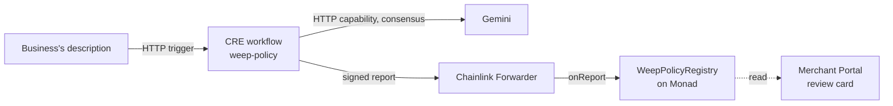

# Weep on Chainlink CRE

A business describes its team in plain words. A [Chainlink Runtime Environment](https://docs.chain.link/cre) (CRE) workflow reads the description with Gemini and checks the answer by the tip pool's own rules. It then writes the result to Monad, as a report signed by the Chainlink network. The Merchant Portal shows **Read by Chainlink CRE · attested on Monad** on the review card when the business's review matches that record.



## What it records, and what it can't do

- **What's recorded:** the split between floor, kitchen and bar, each person's first name and group, and a hash of the description. Emails and wallets are never part of a report. The workflow refuses any name that looks like one.
- **No power.** [WeepPolicyRegistry](../contracts/contracts/WeepPolicyRegistry.sol) is a record only. It holds no money and can't change any pool. The business still reviews the proposal and saves it to its own pool with its own wallet.
- **Only the Forwarder writes.** The registry accepts reports only from the Chainlink Forwarder set when it was deployed. It refuses anything the pool would refuse: a split that isn't 100%, more than 100 people, or an unknown group.
- **Names are public.** First names in a report are stored on Monad, which anyone can read.

## Files

| File | What it is |
|---|---|
| [`weep-policy/main.ts`](weep-policy/main.ts) | The workflow: HTTP trigger, Gemini call through the HTTP capability with identical-answer consensus, report, write to Monad |
| [`weep-policy/policy.ts`](weep-policy/policy.ts) | The prompt, the answer's fixed schema, and the checks that turn an answer into a policy |
| [`weep-policy/policy.test.ts`](weep-policy/policy.test.ts) | Tests for those checks (`npm test`, no CRE account needed) |
| [`weep-policy/config.staging.json`](weep-policy/config.staging.json) | Chain (`monad-testnet`), registry address, gas limit, Gemini model |
| [`weep-policy/payload.example.json`](weep-policy/payload.example.json) | An example request: a pool address and a description |
| [`project.yaml`](project.yaml), [`secrets.yaml`](secrets.yaml), [`.env.example`](.env.example) | CLI settings: the Monad RPC, and the names of the secrets (never their values) |

## Run it

You need a CRE account (free, at [cre.chain.link](https://cre.chain.link)), [Bun](https://bun.sh), a Gemini API key, and a wallet with a little Monad testnet MON to pay for the transaction.

1. **Install the CRE CLI** (Windows PowerShell), then open a new window:

   ```powershell
   irm https://app.chain.link/cre/install.ps1 | iex
   cre version
   ```

2. **Log in** (it opens the browser): `cre login`
3. **Install the workflow's packages:** `cd cre/weep-policy`, then `bun install`.
4. **Add your secrets.** Copy `cre/.env.example` to `cre/.env` (git ignores it), then fill in `GEMINI_API_KEY_ENV` and `CRE_ETH_PRIVATE_KEY`.
5. **Simulate, writing to Monad testnet.** From `cre/`:

   ```powershell
   cre workflow simulate weep-policy --target staging-settings --non-interactive --trigger-index 0 --http-payload weep-policy/payload.example.json --broadcast
   ```

   The CLI compiles the workflow, calls Gemini, and sends the signed report to Monad through Chainlink's MockKeystoneForwarder. It prints the transaction link.

**Our run, 9 October 2026:** Gemini read the example in about 2 seconds, and [this transaction](https://testnet.monadexplorer.com/tx/0x3803dec912c6d9d4af4776f252f40cb0d712e87bde554e29f3c3f3adf9f77ac3) recorded Sam and Ama (floor) and Kai (kitchen), split 70/30/0, in [WeepPolicyRegistry](https://testnet.monadexplorer.com/address/0x6437a6BD79d388E70f726Fee9f15f3d0245ddc9c). The registry is verified on [MonadVision](https://testnet.monadvision.com/address/0x6437a6BD79d388E70f726Fee9f15f3d0245ddc9c) and trusts the simulation forwarder.

The workflow uses Gemini 3.5 Flash-Lite with minimal thinking. CRE stops any HTTP request after 10 seconds. In our tests Flash-Lite answered in 1–2 seconds, while 3.5 Flash with default thinking took up to 34.

The simulation runs on your computer. The Gemini call is real, and the transaction is a real one on Monad testnet. Deploying the workflow to the Chainlink network itself needs approval from Chainlink (`cre account access`). It also needs a registry that trusts the production KeystoneForwarder, and `authorizedKeys` set on the HTTP trigger.

## Forwarders on Monad testnet

| Use | Forwarder |
|---|---|
| Simulation (`--broadcast`) | `0xB9F79d863261869B234c481D1f9A7af84AeAd192` (MockKeystoneForwarder) |
| Deployed workflows | `0xF8344CFd5c43616a4366C34E3EEE75af79a74482` (KeystoneForwarder) |

Deploy the registry for either with [`contracts/scripts/deploy-policy-registry.js`](../contracts/scripts/deploy-policy-registry.js). Without `FORWARDER` set, it uses the simulation one.
