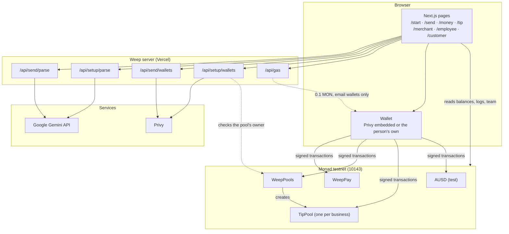
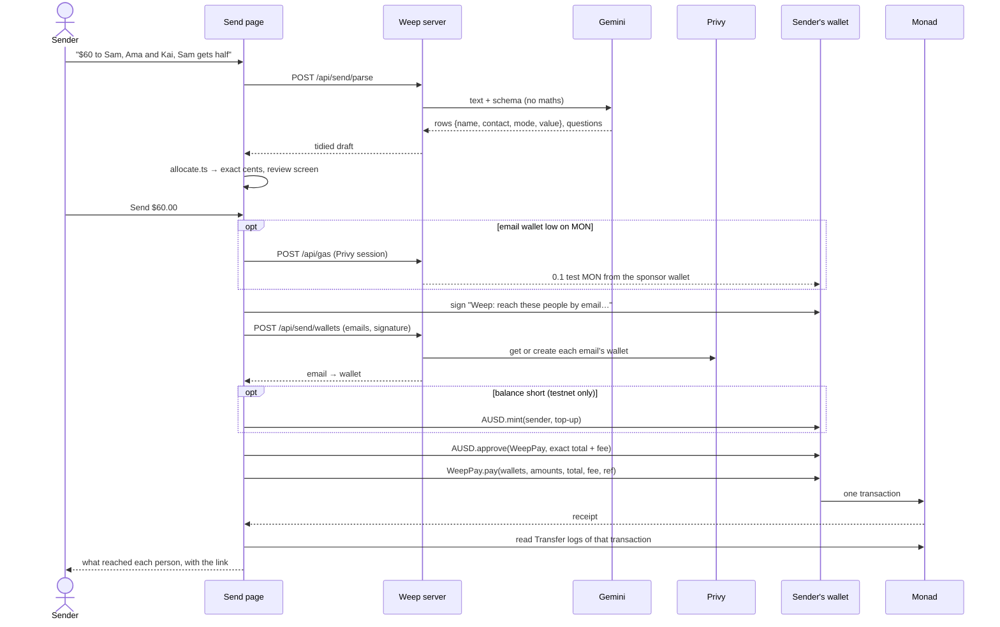

# Architecture

How Weep is built: the parts, how money and data move through them, who controls what, and what happens when something fails. It describes the deployed system on Monad testnet as of 8 October 2026.

For what each route accepts and returns, see [api.md](api.md). For the plain-language version, see [How money moves](https://weep-protocol.vercel.app/how-money-moves).

## System at a glance



**The browser** renders every screen, works out amounts, and reads Monad directly through the public RPC. Every transaction is signed in the person's own wallet.

**The server** does only what can't be done safely in a browser. It holds the Gemini key, the Privy app secret and the sponsor wallet that covers first fees. It has no database and stores nothing about users or payments.

**Monad** holds all the state: balances, payments, each business's team and split.

## Components

| Part | Responsibility | Source |
|---|---|---|
| Role chooser | Individual · Business switch (remembered) and three cards per side | [`Hero.tsx`](../frontend/src/app/Hero.tsx), [`roles.ts`](../frontend/src/app/roles.ts) |
| Send | Words → draft rows → exact review → one WeepPay payment → receipt from logs | [`send/SendFlow.tsx`](../frontend/src/app/send/SendFlow.tsx) |
| Amount rules | Fixed, percentage, equal; leftover cents to the first rows | [`allocate.ts`](../frontend/src/app/allocate.ts) |
| My money / Employee Dashboard | Balance and payments in, with sender and time | [`received.ts`](../frontend/src/app/received.ts), [`money/`](../frontend/src/app/money), [`employee/`](../frontend/src/app/employee) |
| Tip / Customer | Opens a code or link; tips a person or the team | [`tip/`](../frontend/src/app/tip), [`customer/TipFlow.tsx`](../frontend/src/app/customer/TipFlow.tsx) |
| Merchant Portal | One-prompt team setup, live pool, payout | [`merchant/TeamSetup.tsx`](../frontend/src/app/merchant/TeamSetup.tsx) |
| Chain access | RPC, explorer, call data, receipts (`transfersIn`), recent arrivals (`receivedRecently`) | [`chain.ts`](../frontend/src/app/chain.ts), [`pay.ts`](../frontend/src/app/pay.ts) |
| Reading descriptions | One shared Gemini helper: structured JSON, model fallback, one retry, 20-second timeout | [`api/gemini.ts`](../frontend/src/app/api/gemini.ts) |
| Sign-in | Weep's own window: email code or wallet; Privy underneath | [`ConnectModal.tsx`](../frontend/src/app/ConnectModal.tsx), [`providers.tsx`](../frontend/src/app/providers.tsx) |
| WeepPay | `pay(to[], amounts[], total, expectedFee, ref)`: exact, all-or-nothing, ≤ 100 recipients, 0.3% fee on top (fixed at deployment), no owner | [`WeepPay.sol`](../contracts/contracts/WeepPay.sol) |
| WeepPools | Gives every business its own pool: `create(split, team)` clones TipPool, one per owner, at an address known in advance (`predict`). Holds the token, fee rate (0.5%) and fee recipient every pool copies. No owner | [`WeepPools.sol`](../contracts/contracts/WeepPools.sol) |
| TipPool | One business's pool: `tipIndividual(name, expectedWallet, amount, expectedFee)`, `tipTeam(amount, expectedFee)`, `payoutTeam()` (anyone), `configure` (owner: split and team in one call). Team capped at 100; token-moving functions guarded against re-entry | [`TipPool.sol`](../contracts/contracts/TipPool.sol) |
| Business links | Table codes and links carry the business's pool (`/customer?pool=0x…`); checked against WeepPools before use and remembered on the device | [`pool-link.ts`](../frontend/src/app/pool-link.ts) |
| First-fee cover | An email wallet that's low on MON gets 0.1 test MON from Weep's sponsor wallet before its first transaction | [`gas.ts`](../frontend/src/app/gas.ts), [`api/gas`](../frontend/src/app/api/gas/route.ts) |

## Flows

### Send: one payment to many people



`ref` is `keccak256` of the recipient:amount pairs. It ties the payment to what was reviewed without putting names or emails on Monad.

### Business: set up, tip, pay out

1. **Set up** (Merchant Portal). Any business can do this; each gets its own pool.
   1. `/api/setup/parse` reads the team description: names, emails, groups and split.
   2. The business reviews it. If Weep's Chainlink CRE workflow has attested this exact description for this pool, and the review still matches, the card says *Read by Chainlink CRE · attested on Monad* (see [Chainlink CRE](#chainlink-cre)).
   3. `/api/setup/wallets` creates wallets for every email. The request names the pool and is signed by its owner, or, before it exists, by the wallet whose pool `WeepPools.predict` puts at that address. The server checks both on Monad.
   4. One confirmation: `WeepPools.create(split, names, wallets, groups)` the first time, or `TipPool.configure(...)` to change it later.
   5. The live screen shows the table code: `/customer?pool=<the business's pool>`.
2. **Tip a person** (Customer, opened from that code). The page checks with WeepPools that the pool is real and reads its fee. The guest sees the 0.5% fee, approves exactly the tip plus the fee, and `tipIndividual(name, wallet, amount, fee)` moves the tip straight to that person and the fee to Weep. If the name now points to a different wallet than the guest saw, or the fee differs, nothing moves.
3. **Tip the team** (Customer). The guest approves the tip plus the fee, and `tipTeam(amount, fee)` moves the tip into the business's pool and the fee to Weep.
4. **Pay out** (Merchant Portal, or anyone from the table code's *Split details*). Anyone can call `payoutTeam()`; it only pays the saved team.
   - The pool is split by policy among groups that have people.
   - Each group's share is split evenly within the group.
   - Any remainder from integer division (well under a cent) stays for the next payout.

### Receiving

My money and the Employee Dashboard poll every 4 seconds while the tab is visible. Each poll reads the wallet's AUSD balance and the `Transfer` events into it over the last ~100 blocks, which is the public RPC's log window. Block timestamps give each payment's time. Payments seen are remembered on the device, so the list survives reloads. If the sender is a Weep pool (checked with WeepPools), the payment is labelled "team tips". A tab that comes back into view reads at once instead of waiting for the next poll.

## Amount rules

The rules live in [`allocate.ts`](../frontend/src/app/allocate.ts):

1. Fixed amounts are taken first.
2. Percentages of the total come next, rounded down to the cent.
3. The remainder is divided equally among rows marked equal.
4. Leftover cents go one each to the first rows, and the review marks them with +1¢.

If fixed and percentage amounts exceed the total, or nothing is left for equal rows, the review shows the problem and sending is disabled. WeepPay checks the sum again on-chain.

### Chainlink CRE

The [`cre/weep-policy`](../cre) workflow reads a team description through Chainlink's network and records the result on Monad.

1. An HTTP trigger receives `{ pool, description }`.
2. Through the HTTP capability, Gemini reads the team and split at temperature 0, against a fixed schema. The response is cached across nodes, so they reach identical-answer consensus.
3. `policy.ts` checks the answer by the pool's rules: the split adds up to 100, 1–100 people, unique names, and no name that looks like an email or wallet.
4. The workflow encodes `(pool, keccak256(description), foh, boh, bar, names, groups)` as a report the DON signs. `writeReport` delivers it through the Chainlink Forwarder to `WeepPolicyRegistry.onReport`.
5. The registry checks the same rules again, stores the latest policy for that pool and emits `PolicyAttested`.
6. The Merchant Portal reads `policyOf(pool)`. It shows the line only when the description's hash matches the text the business typed and the reviewed team and split are identical.

The registry is a record. It can't move money or change a pool; saving is still the business's own `create` or `configure`.

## Trust boundaries

| Actor | Can | Can't |
|---|---|---|
| Sender | Pay anyone up to the amount their wallet allowed | Spend another wallet's funds |
| WeepPay | Move a sender's AUSD within the allowance the sender gave, in a payment the sender signed | Hold funds, be paused, be upgraded, or be controlled by anyone (it has no owner) |
| A business (pool owner) | Set its own pool's team and split | Touch any other business's pool; take a tip sent to a person by name, which never enters the pool; change the fee |
| Anyone | Pay a pool out | Choose who gets paid: a payout only ever goes to the saved team, by the saved split |
| Weep (fee recipient) | Receive the fee set at deployment | Change the fee rate or recipient, or touch any payment or pool |
| WeepPools | Create one pool per business, owned by that business | Change, pause or drain any pool (it has no owner and no admin functions) |
| Weep server | Ask Privy for wallets for emails a signer named; read text with Gemini; send 0.1 test MON to a signed-in person's own email wallet when it's low | Sign transactions for anyone, hold their keys, or move their funds |
| Privy | Create and link non-custodial wallets to emails; run sign-in | Spend from a user's wallet (non-custodial) |
| Chainlink Forwarder | Write a DON-signed policy record to WeepPolicyRegistry | Change any pool, move any funds, or write a policy the pool would refuse |
| Gemini | Draft rows from text | Calculate amounts or send anything (the code does the maths; the person approves) |

Abuse controls on the server routes:

- Email lookups need a fresh signature (under 10 minutes old) over the exact sorted emails, with at most 100 emails per request.
- Team wallets need the pool owner's signature (or, before the pool exists, the signature of the wallet whose pool will be created there), with at most 50 emails.
- Descriptions are limited to 6,000 characters for Send and 4,000 for the Merchant Portal.
- First-fee cover needs a valid Privy session for the wallet's owner, applies only to Privy email wallets holding under 0.05 MON with fewer than 20 transactions, and stops if the sponsor would fall below 1 MON.

## Failure handling

| Failure | What the person sees | Money |
|---|---|---|
| Gemini busy or failing | Each model gets one retry after a short pause, then the next model takes over. If all of them fail: "Couldn't read that just now. Try again, or add the people yourself." | Nothing moves |
| Server keys missing | Send asks you to add people yourself; email payments say they're not switched on | Nothing moves |
| Email lookup fails | "Couldn't reach those emails just now. Nothing was sent." | Nothing moves |
| No MON for fees | Email wallets: Weep covers it ("Covering the network fee"). Other wallets, or if cover is off: the faucet opens, with a note | Nothing moves until the fee is there |
| A table code that isn't a Weep pool | "This code isn't a Weep tip pool", and nothing can be sent | Nothing moves |
| Wrong network | "Switch to Monad at the top, then send." | Nothing moves |
| Wallet prompt rejected | "Cancelled. Nothing was sent." | Nothing moves |
| One recipient invalid, or the total doesn't match | The contract reverts: "The network turned the payment down. Nothing was sent." | Nothing moves (all-or-nothing) |
| Confirmation slow | A pending state that checks again without sending anything new | One payment, or none |

## Data

Weep's server keeps no data. Privy holds sign-in emails and their wallets. Monad holds payments and business teams (first names, wallets, groups). The browser keeps a few conveniences in local storage. The full inventory, purposes and retention are in the [Privacy notice](https://weep-protocol.vercel.app/privacy).

## Decisions

| Decision | Why | Trade-off |
|---|---|---|
| A separate WeepPay contract for individuals, instead of a pool | Paying people should need no owner, no registry and no pool. One short function anyone can read, with no admin keys. | Two contracts to explain |
| The AI drafts, code calculates | Language models can misread, but they shouldn't do arithmetic on money. Deterministic rules make every cent reproducible. | The AI can't express rules outside fixed, percentage and equal |
| Emails resolved to Privy wallets at send time | Anyone with an email can be paid, with nothing to claim and no custody | Relies on Privy; Weep doesn't notify recipients |
| One signature authorizes an email lookup | Stops anonymous mass account creation, without accounts or API keys | One extra wallet prompt when paying emails |
| Receipts read from `Transfer` logs | The receipt shows what actually happened on-chain, not what the app intended | One extra RPC read after each payment |
| No server database | Nothing to leak, migrate or keep in sync; Monad is the record | In-app history covers recent blocks; full history is on the explorer |
| Exact-total approval | A compromised website could never spend more than the reviewed total plus fee | One approval per payment when the allowance runs out |
| Fee on top, fixed at deployment | Recipients and staff always get 100% of the stated amount; nobody, including Weep, can raise the fee later; the payer's reviewed fee must match | A new rate means new contracts |
| Named tips carry the wallet the guest saw | A business can't redirect a tip in flight by repointing a name | A guest who reviewed an old team must reload |
| Anyone can pay a pool out | Staff don't depend on the owner to release tips; the money can only go to the saved team | None that we know of: the caller gains nothing |
| No `agent` role | Nothing in the app ever named one; fewer roles, smaller surface | A business that wants a helper shares the owner wallet |
| A pool per business from a factory, as minimal clones | Any business can try the full flow and owns its pool outright; a clone costs about 0.05 MON to create instead of about 0.36 MON for a full contract; a predictable address lets the team's wallets be approved first | Pools can't be upgraded; a new version means a new factory |
| Cover the first fee for email sign-ins | A first payment needs nothing but an email: no faucet, no tokens to find | A funded sponsor wallet on the server; abuse limited by session, wallet type, balance and transaction count |

## Repository map

```text
contracts/            Solidity contracts, Hardhat tests, deploy scripts
  contracts/          WeepPay.sol · WeepPools.sol · TipPool.sol · WeepPolicyRegistry.sol · MockAUSD.sol · mocks/ReentrantToken.sol (tests only)
  scripts/            deploy-all.js · deploy-policy-registry.js · retire-shared-pool.js · live-loop.js · benchmark.js
  test/               WeepPay.test.js · WeepPools.test.js · WeepPolicyRegistry.test.js
cre/                  Chainlink CRE project: weep-policy workflow (TypeScript), CLI settings
frontend/             Next.js app (App Router)
  src/app/            pages, components, chain and amount logic
  src/app/api/        send/{parse,wallets} · setup/{parse,wallets} · gas
docs/                 architecture.md · api.md
```

Experiments not used by the live app are listed in the README's [Limits](../README.md#limits).
