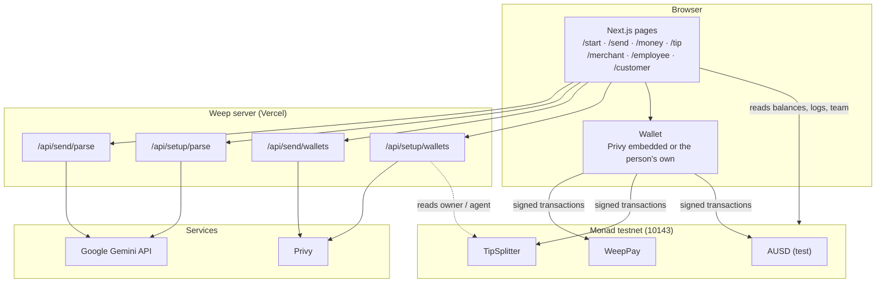
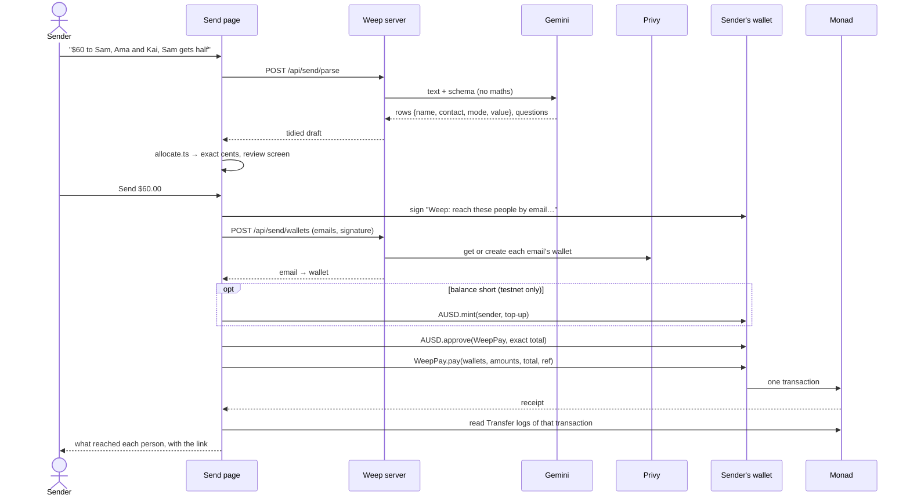

# Architecture

How Weep is built: the parts, how money and data move through them, who controls what, and what happens when something fails. It describes the deployed system on Monad testnet as of 8 October 2026.

For what each route accepts and returns, see [api.md](api.md). For the plain-language version, see [How money moves](https://weep-protocol.vercel.app/how-money-moves).

## System at a glance



**The browser** renders every screen, works out amounts, and reads Monad directly through the public RPC. Every transaction is signed in the person's own wallet.

**The server** does only what can't be done safely in a browser. It holds the Gemini key and the Privy app secret. It has no database and stores nothing about users or payments.

**Monad** holds all the state: balances, payments, each business's team and split.

## Components

| Part | Responsibility | Source |
|---|---|---|
| Role chooser | Individual · Business switch (remembered) and three cards per side | [`Hero.tsx`](../frontend/src/app/Hero.tsx), [`roles.ts`](../frontend/src/app/roles.ts) |
| Send | Words → draft rows → exact review → one WeepPay payment → receipt from logs | [`send/SendFlow.tsx`](../frontend/src/app/send/SendFlow.tsx) |
| Amount rules | Fixed, percentage, equal; leftover cents to the first rows | [`allocate.ts`](../frontend/src/app/allocate.ts) |
| My money / Employee Dashboard | Balance and payments in, with sender and time | [`received.ts`](../frontend/src/app/received.ts), [`money/`](../frontend/src/app/money), [`employee/`](../frontend/src/app/employee) |
| Tip / Customer | Opens a code or link; tips a person or the team | [`tip/`](../frontend/src/app/tip), [`customer/TipFlow.tsx`](../frontend/src/app/customer/TipFlow.tsx) |
| Merchant Portal | One-prompt team setup, live pool, payout | [`merchant/TeamSetup.tsx`](../frontend/src/app/merchant/TeamSetup.tsx) |
| Chain access | RPC, explorer, call data, receipts (`transfersIn`), recent arrivals (`receivedRecently`) | [`chain.ts`](../frontend/src/app/chain.ts), [`pay.ts`](../frontend/src/app/pay.ts) |
| Sign-in | Weep's own window: email code or wallet; Privy underneath | [`ConnectModal.tsx`](../frontend/src/app/ConnectModal.tsx), [`providers.tsx`](../frontend/src/app/providers.tsx) |
| WeepPay | `pay(to[], amounts[], total, ref)`: exact, all-or-nothing, ≤ 100 recipients, no owner | [`WeepPay.sol`](../contracts/contracts/WeepPay.sol) |
| TipSplitter | Team registry, split policy, `tipIndividual`, `setTeam`, `payoutTeam` | [`TipSplitter.sol`](../contracts/contracts/TipSplitter.sol) |

## Flows

### Send: one payment to many people



`ref` is `keccak256` of the recipient:amount pairs. It ties the payment to what was reviewed without putting names or emails on Monad.

### Business: set up, tip, pay out

1. **Set up** (Merchant Portal).
   1. `/api/setup/parse` reads the team description: names, emails, groups and split.
   2. The owner reviews it.
   3. `/api/setup/wallets` creates wallets for every email. This needs a signature from the pool's owner or agent, which the server checks against the contract.
   4. The owner's wallet sends `updatePolicy(floor, kitchen, bar)` and then `setTeam(names, wallets, groups)`.
2. **Tip a person** (Customer). The guest approves exactly the tip, and `tipIndividual(name, amount)` moves it straight from the guest to that person's wallet.
3. **Tip the team** (Customer). The guest transfers AUSD to the pool contract.
4. **Pay out** (Merchant Portal). The owner calls `payoutTeam()`.
   - The pool is split by policy among groups that have people.
   - Each group's share is split evenly within the group.
   - Any remainder from integer division (well under a cent) stays for the next payout.

### Receiving

My money and the Employee Dashboard poll every 4 seconds while the tab is visible. Each poll reads the wallet's AUSD balance and the `Transfer` events into it over the last ~100 blocks, which is the public RPC's log window. Block timestamps give each payment's time. Payments seen are remembered on the device, so the list survives reloads. If the sender is the pool contract, the payment is labelled "team tips".

## Amount rules

The rules live in [`allocate.ts`](../frontend/src/app/allocate.ts):

1. Fixed amounts are taken first.
2. Percentages of the total come next, rounded down to the cent.
3. The remainder is divided equally among rows marked equal.
4. Leftover cents go one each to the first rows, and the review marks them with +1¢.

If fixed and percentage amounts exceed the total, or nothing is left for equal rows, the review shows the problem and sending is disabled. WeepPay checks the sum again on-chain.

## Trust boundaries

| Actor | Can | Can't |
|---|---|---|
| Sender | Pay anyone up to the amount their wallet allowed | Spend another wallet's funds |
| WeepPay | Move a sender's AUSD within the allowance the sender gave, in a payment the sender signed | Hold funds, be paused, be upgraded, or be controlled by anyone (it has no owner) |
| TipSplitter owner / agent | Set the team and split, register people, pay out the pool | Take a tip sent to a person by name, which never enters the pool |
| Weep server | Ask Privy for wallets for emails a signer named; read text with Gemini | Sign transactions, hold keys, or move funds |
| Privy | Create and link non-custodial wallets to emails; run sign-in | Spend from a user's wallet (non-custodial) |
| Gemini | Draft rows from text | Calculate amounts or send anything (the code does the maths; the person approves) |

Abuse controls on the server routes:

- Email lookups need a fresh signature (under 10 minutes old) over the exact sorted emails, with at most 100 emails per request.
- Team wallets need the pool owner's or agent's signature, with at most 50 emails.
- Descriptions are limited to 6,000 characters for Send and 4,000 for the Merchant Portal.

## Failure handling

| Failure | What the person sees | Money |
|---|---|---|
| Gemini busy or failing | "Couldn't read that just now. Try again, or add the people yourself." | Nothing moves |
| Server keys missing | Send asks you to add people yourself; email payments say they're not switched on | Nothing moves |
| Email lookup fails | "Couldn't reach those emails just now. Nothing was sent." | Nothing moves |
| No MON for fees | The faucet opens, with a note | Nothing moves |
| Wrong network | "Switch to Monad at the top, then send." | Nothing moves |
| Wallet prompt rejected | "Cancelled. Nothing was sent." | Nothing moves |
| One recipient invalid, or the total doesn't match | The contract reverts: "The network turned the payment down. Nothing was sent." | Nothing moves (all-or-nothing) |
| Confirmation slow | A pending state that checks again without sending anything new | One payment, or none |

## Data

Weep's server keeps no data. Privy holds sign-in emails and their wallets. Monad holds payments and business teams (first names, wallets, groups). The browser keeps a few conveniences in local storage. The full inventory, purposes and retention are in the [Privacy notice](https://weep-protocol.vercel.app/privacy).

## Decisions

| Decision | Why | Trade-off |
|---|---|---|
| A separate WeepPay contract for individuals, instead of extending TipSplitter | Paying people should need no owner, no registry and no pool. One short function anyone can read, with no admin keys. | Two contracts to explain |
| The AI drafts, code calculates | Language models can misread, but they shouldn't do arithmetic on money. Deterministic rules make every cent reproducible. | The AI can't express rules outside fixed, percentage and equal |
| Emails resolved to Privy wallets at send time | Anyone with an email can be paid, with nothing to claim and no custody | Relies on Privy; Weep doesn't notify recipients |
| One signature authorizes an email lookup | Stops anonymous mass account creation, without accounts or API keys | One extra wallet prompt when paying emails |
| Receipts read from `Transfer` logs | The receipt shows what actually happened on-chain, not what the app intended | One extra RPC read after each payment |
| No server database | Nothing to leak, migrate or keep in sync; Monad is the record | In-app history covers recent blocks; full history is on the explorer |
| Exact-total approval | A compromised website could never spend more than the reviewed total | One approval per payment when the allowance runs out |

## Repository map

```text
contracts/            Solidity contracts, Hardhat tests, deploy scripts
  contracts/          WeepPay.sol · TipSplitter.sol · MockAUSD.sol
  test/               WeepPay.test.js · TipSplitter.test.js
frontend/             Next.js app (App Router)
  src/app/            pages, components, chain and amount logic
  src/app/api/        send/{parse,wallets} · setup/{parse,wallets}
docs/                 architecture.md · api.md
```

Experiments not used by the live app are listed in the README's [Limits](../README.md#limits).
